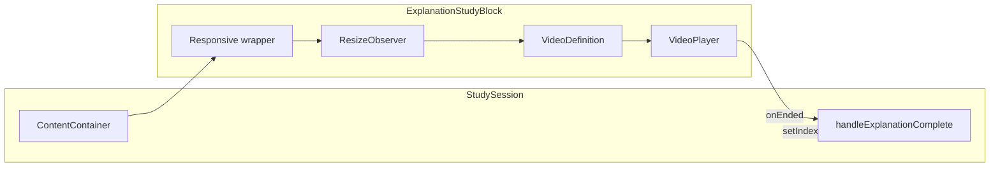

# ExplanationStudyBlock with VideoPlayer

## Current state

- [ExplanationStudyBlock.ts](src/eduriam-ui-x/src/components/study-session/components/study-blocks/explanation/ExplanationStudyBlock.ts) defines `ExplanationStudyBlockDTO` with `type: "explanation"` and `scenes: Scene[]` (no React component yet).
- [VideoPlayer.tsx](src/eduriam-ui-x/src/components/video-manager/video-player/VideoPlayer.tsx) takes a `VideoDefinition` (scenes, fps, videoWidth, videoHeight), builds via `VideoBuilder.buildVideo`, and renders Remotion `<Player>`. It does not expose ref or end-of-playback.
- [VideoDefinition](src/eduriam-ui-x/src/components/video-manager/video/VideoDefinition.ts) requires `scenes`, `fps`, `videoWidth`, `videoHeight`.
- [StudySession.tsx](src/eduriam-ui-x/src/components/study-session/StudySession.tsx) only renders when `studyBlockQueue[index].type === "exercise"`; explanation blocks are not rendered. Advance logic lives in `handleContinue` (exercise result + optional reschedule + transition/finish).

Remotion Player supports an `ended` event via `PlayerRef.addEventListener('ended', callback)` (see [Player docs](https://www.remotion.dev/docs/player/player)).

---

## 1. FPS constant

- Add a shared constant for explanation video FPS (30) so it can be reused and changed in one place.
- **Suggested location:** new file `src/eduriam-ui-x/src/components/video-manager/video-player/videoPlayerConfig.ts` (or `constants.ts` in video-manager) exporting e.g. `EXPLANATION_VIDEO_FPS = 30`. Alternatively, a small `videoConstants.ts` in video-manager if you prefer a single place for future video-related constants.

---

## 2. VideoPlayer: support `onEnded`

- In [VideoPlayer.tsx](src/eduriam-ui-x/src/components/video-manager/video-player/VideoPlayer.tsx):
  - Add optional prop `onEnded?: () => void`.
  - Use a ref for the Remotion `<Player>` (e.g. `useRef<PlayerRef>(null)`), pass it to `Player` via `ref={playerRef}`.
  - In `useEffect`, if `onEnded` is provided and `playerRef.current` is set, call `playerRef.current.addEventListener('ended', onEnded)` and return a cleanup that removes the listener. Handle the case where the ref is populated after mount (e.g. effect dependency on a state that flips after first layout, or subscribe in an effect that runs when ref.current becomes available).
- No change to `VideoDefinition` or `VideoBuilder`; they already support variable fps and dimensions.

---

## 3. ExplanationStudyBlock component

- **New file:** `ExplanationStudyBlock.tsx` next to existing `ExplanationStudyBlock.ts` (keep the DTO in the .ts file; implement the UI in .tsx).

**Props (interface):**

- `scenes: Scene[]` (from `ExplanationStudyBlockDTO`).
- `onComplete: () => void` – called when the video has finished so the parent can advance to the next block.

**Behavior:**

- Build a `VideoDefinition` from:
  - `scenes` (from props).
  - `fps`: use the new constant (30).
  - `videoWidth` and `videoHeight`: derived from a **measured container size** (see below).
- Render a wrapper that:
  - **Desktop (e.g. `useMediaQuery(theme.breakpoints.up('md'))`):** constrains the video to the parent width and 16:9 aspect ratio (e.g. wrapper with `width: '100%'`, `aspectRatio: '16/9'`, or explicit height = width 9/16).
  - **Mobile:** fills the available space (e.g. `width: '100%'`, `height: '100%'`, `flex: 1`, `minHeight: 0` so it can shrink inside the flex layout).
- Use a **ref + ResizeObserver** (or a single `useEffect` that measures the wrapper div) to get the wrapper’s width and height. From that:
  - **Desktop:** set composition dimensions to `videoWidth = measuredWidth`, `videoHeight = measuredWidth * (9/16)` (or match the 16:9 box you’re rendering).
  - **Mobile:** set `videoWidth = measuredWidth`, `videoHeight = measuredHeight` so the composition matches the container (portrait/shorts-style).
- Pass the resulting `VideoDefinition` to `VideoPlayer`, and pass `onEnded={onComplete}` so that when the Remotion video ends, `onComplete` is called once.
- Ensure the wrapper used for measurement is the same one that defines the layout (desktop 16:9, mobile fill), so dimensions stay in sync. Handle initial render (e.g. zero size) by not rendering the player until you have valid dimensions, or use a fallback (e.g. 16:9 default) to avoid Remotion errors.

**Layout summary:**

| Breakpoint | Wrapper behavior               | Composition size                                                  |
| ---------- | ------------------------------ | ----------------------------------------------------------------- |
| Desktop    | Width 100%, aspect ratio 16/9  | `videoWidth = container width`, `videoHeight = videoWidth * 9/16` |
| Mobile     | Width 100%, height 100% (fill) | `videoWidth = container width`, `videoHeight = container height`  |

---

## 4. StudySession integration

- In [StudySession.tsx](src/eduriam-ui-x/src/components/study-session/StudySession.tsx):
  - **Render branch:** Extend the conditional inside `ContentContainer` so that when `studyBlockQueue[index].type === "explanation"`, render `ExplanationStudyBlock` with `scenes={studyBlockQueue[index].scenes}` and `onComplete={handleExplanationComplete}`.
  - **Handler:** Add `handleExplanationComplete` that:
    - Updates `furthestCompletedIndex` to at least `index` (so navigation can go forward past this block).
    - If `index < studyBlockQueue.length - 1`: run the same transition as in `handleContinue` (e.g. `triggerTransition(() => setIndex(index + 1), 'forward')`).
    - If this was the last block: set `finishedSession` to true, compute `finishedStatsSnapshot` (reuse existing stats logic from `handleContinue`), and call `onFinish(studyStats, atomProgressRatings)`. Explanation blocks do not contribute to `atomStatsMap` (no right/wrong); reuse the same `evaluateStats` / `computeAtomRatings` with the current map.
  - **Navigation:** Ensure `canGoForward` already allows advancing when `index <= furthestCompletedIndex` and there is a next block, so explanation completion only needs to update `furthestCompletedIndex` and optionally trigger the transition (or let the user tap “next”); per your requirement (“automatically continue”), call the transition from `handleExplanationComplete` so the next block appears without a button.
  - **Revisit:** When revisiting an explanation block (`index <= furthestCompletedIndex`), still render it; you may pass a prop like `isRevisiting` if you want to auto-play or skip (optional; can be a follow-up).

---

## 5. File and export checklist

- Add/update:
  - `video-manager`: new constant file (e.g. `videoPlayerConfig.ts` or `videoConstants.ts`) with `EXPLANATION_VIDEO_FPS`.
  - `VideoPlayer.tsx`: optional `onEnded`, internal `PlayerRef`, effect to add/remove `ended` listener.
  - `ExplanationStudyBlock.tsx`: new component (wrapper + resize logic + `VideoDefinition` + `VideoPlayer` + `onComplete`).
- [StudySession.tsx](src/eduriam-ui-x/src/components/study-session/StudySession.tsx): conditional render for `type === "explanation"`, `handleExplanationComplete`, and last-block finish flow for explanation-only end.

No change to `ExplanationStudyBlock.ts` (DTO only) or to `StudyBlockDTO` / `VideoBuilder` / `VideoDefinition` types beyond using the new FPS constant when building the definition.

---

## Optional refinements

- **Controls:** You may set `controls={true}` on the Player for explanation blocks so users can pause/seek; if you prefer minimal UI, set `controls={false}` and rely on click-to-play and auto-advance.
- **moveToBeginningWhenEnded:** Remotion defaults this to `true`; for auto-advance you only need `onEnded`; no need to set it to `false` unless you want to show a poster after end.
- **Accessibility:** Ensure the video container has a sensible label/aria so screen readers know it’s an explanation video.

---

## Diagram (data flow)

