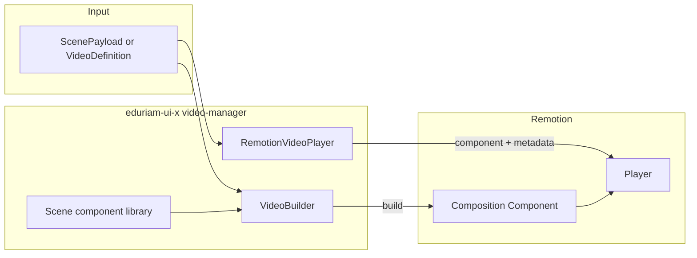

# Remotion Video Player and VideoBuilder (aligned with EduriamSTV)

## Context: existing rendering service and source of truth

- **EduriamSTV** (at project root, in `.gitignore`) is the existing service that **renders MP4 videos** from JSON definitions. It uses Remotion and exposes `/scene-generator` and `/render` endpoints. Flow: `ScenePayload` → `materializeSlides(slides)` → asset rewriting → (optional TTS for timing) → composition `scene-generator` with `inputProps` → `renderMedia` → MP4.
- **Goal**: Make **eduriam-ui-x** the **source of truth** for (1) the **VideoBuilder** (and thus the composition built from JSON) and (2) the **library of all Remotion scene components** used in that composition. The same JSON definitions (slides, component types) will be used by both: eduriam-ui-x for in-browser playback via Remotion Player; EduriamSTV for server-side MP4 rendering (can later consume types or composition from eduriam-ui-x).

## Scope (this iteration)

- **Types and slide model**: Mirror `EduriamSTV/src/types/scene.ts` and `EduriamSTV/src/models/slides.ts` in eduriam-ui-x (scene types, `ScenePayload`, `Slide`, `SceneComponent`, slide materialization).
- **VideoBuilder**: Same role as `EduriamSTV/remotion/scene-generator/SceneGenerator.tsx`: accepts flat `SceneComponent[]` (and optional `audioUrl`, `audioDurationMs`, `componentStartMs`), renders one background (BACKGROUND_COLOR | BACKGROUND_IMAGE | BACKGROUND_VIDEO) plus non-background components each in a Remotion `Sequence`. VideoBuilder composes the **shared scene components** from the video-manager library.
- **Scene components**: Implement every component type that SceneGenerator uses—**11 types**—each in its **own folder** with its **own Storybook story**: BACKGROUND_COLOR, HEADER, PAGE_HEADER, PAGE_SUBHEADER, PARAGRAPH, LIST, TABLE, IMAGE, VIDEO, BACKGROUND_IMAGE, BACKGROUND_VIDEO.
- **RemotionVideoPlayer**: Accepts a video definition (e.g. `ScenePayload` plus composition metadata). Uses VideoBuilder to get the composition component and metadata; renders via Remotion Player.
- **Location**: `eduriam-ui-x/src/components/video-manager/` (and subfolders per component).
- **No ExplanationStudyBlock** in this iteration.

## Dependencies

Remotion is not currently in the repo. Add to [src/eduriam-ui-x/package.json](src/eduriam-ui-x/package.json):

- `**remotion` – AbsoluteFill, Sequence, useVideoConfig, Audio, etc.
- `**@remotion/player` – `<Player>` for in-browser playback. EduriamSTV uses remotion ^4.0.353; align version for compatibility.

Add both as **dependencies** (or `remotion` as dependency and `@remotion/player` as dependency; Remotion docs recommend installing both). Peer dependency for `react`/`react-dom` is already satisfied (React 18).

## Video definition and types (aligned with EduriamSTV)

Scene types and slide model in eduriam-ui-x:

- `**durationInFrames` (number) – length of the video.
- `**fps` (number) – frame rate.
- `**compositionWidth` (number) – width in pixels.
- `**compositionHeight` (number) – height in pixels.
- **Optional**: `title` or `scenes` – placeholder for future “explanation” content (can be ignored by VideoBuilder for now; we only need a valid composition).

Define a TypeScript type (e.g. `VideoDefinition`) in the video-manager folder and use it as the single source of truth for the JSON shape.

## Study block and explanation structure (for videos and ExplanationStudyBlock)

This structure is intended for study sessions: it keeps explanation blocks simple and extendable and reuses EduriamSTV component/position types.

- **StudyBlock** (base): `type: "explanation" | "exercise"`, `atomId: ID`. Shared by all block types.
- **StudyBlockExplanation**: extends StudyBlock with `type: "explanation"` and `scenes: Scene[]`. One explanation block = multiple scenes played in order.
- **Scene**: one "video segment" with its own slides, audio, and subtitles. Matches one Remotion composition (one audio track, one flattened component list). Fields: `slides: Slide[]`, `subtitles` (shape TBD; e.g. segments with startMs/endMs/text or keyed by id), `audio: { url: string }`. Optional `id?: ID` for analytics or deep-linking later.
- **Slide**: `components: SlideComponent[]`. Same idea as EduriamSTV CustomSlide. Optional `id?: ID` if slide identity is needed (e.g. for TTS bookmarks).
- **SlideComponent** (base): `id: ID`, `type: SlideComponentType`, `startTime: number` (ms). Explicit per-component timing; can drive `componentStartMs` for VideoBuilder. Background components (BACKGROUND_COLOR, BACKGROUND_IMAGE, BACKGROUND_VIDEO) can ignore `startTime` or use 0.
- **Concrete component types**: extend SlideComponent with discriminated `type` and type-specific fields (e.g. HeaderSlideComponent: `type: "HEADER"`, `text`, `position`). All component variants and positions come from EduriamSTV so the same VideoBuilder and scene components can render them.
- **SlideComponentType**: use EduriamSTV `ComponentType` (HEADER, PARAGRAPH, PAGE_HEADER, PAGE_SUBHEADER, LIST, TABLE, IMAGE, VIDEO, BACKGROUND_COLOR, BACKGROUND_IMAGE, BACKGROUND_VIDEO).
- **SlideComponentPosition**: use EduriamSTV `Position` (TOP_LEFT, TOP_CENTER, …). Use EduriamSTV `Alignment` (LEFT, CENTER, RIGHT, JUSTIFY) where applicable (e.g. Paragraph).

Relationship to the rest of the plan: one **Scene** (slides + audio + subtitles) maps to one composition input—materialize all slides to a flat `SceneComponent[]`, derive `componentStartMs` from each component's `startTime`, pass `audio.url` and duration to VideoBuilder/RemotionVideoPlayer. **StudyBlockExplanation.scenes** is an array of such scenes; the study session or ExplanationStudyBlock can play them one after another (each scene = one Player composition or one segment in a combined flow). Keep a single `atomId` on the base StudyBlock; no need to repeat it on StudyBlockExplanation.

## Architecture

- **VideoBuilder** (same role as SceneGenerator in EduriamSTV):
  - Input: components (SceneComponent[]), audioUrl, audioDurationMs, componentStartMs, or derived from VideoDefinition via materializeSlides.
  - Method (e.g. build()) returns:
    - A React component that renders a single Remotion composition (using `AbsoluteFill` and, if useful, `useCurrentFrame`). For now this can be a minimal composition (e.g. background + optional title from definition).
    - Composition metadata: `durationInFrames`, `fps`, `compositionWidth`, `compositionHeight` (taken from the definition).
  - Composes the shared scene components from the video-manager library (Header, PageHeader, Paragraph, List, Table, Image, Video, etc.), not inline.
- **RemotionVideoPlayer**: Takes videoDefinition. Uses VideoBuilder to get the composition component and metadata; renders Remotion Player with component, durationInFrames, fps, compositionWidth, compositionHeight, optional controls.

## Scene components (11 types, each in its own folder with Storybook)

Implement each component as a Remotion-ready React component with the same prop shape as EduriamSTV (e.g. `{ comp: HeaderComponent }`). Each in a **separate folder** under video-manager with co-located Storybook story. Same type names and JSON shapes as EduriamSTV scene.ts; same rendering behavior as EduriamSTV SceneGenerator.tsx.

| Component type   | Folder name     | Storybook story             |
| ---------------- | --------------- | --------------------------- |
| BACKGROUND_COLOR | BackgroundColor | BackgroundColor.stories.tsx |
| HEADER           | Header          | Header.stories.tsx          |
| PAGE_HEADER      | PageHeader      | PageHeader.stories.tsx      |
| PAGE_SUBHEADER   | PageSubheader   | PageSubheader.stories.tsx   |
| PARAGRAPH        | Paragraph       | Paragraph.stories.tsx       |
| LIST             | List            | List.stories.tsx            |
| TABLE            | Table           | Table.stories.tsx           |
| IMAGE            | Image           | Image.stories.tsx           |
| VIDEO            | Video           | Video.stories.tsx           |
| BACKGROUND_IMAGE | BackgroundImage | BackgroundImage.stories.tsx |
| BACKGROUND_VIDEO | BackgroundVideo | BackgroundVideo.stories.tsx |

Shared helper: `positionToStyle(position: Position)` (and optionally `resolveSize` for IMAGE/VIDEO) in a shared util. Each component story: render in a fixed-size container or Remotion Player with a single-component composition; use Storybook controls for props.

## File structure

- `src/eduriam-ui-x/src/components/video-manager/`
  - **types/** or **types.ts** – All scene types and ScenePayload (from EduriamSTV scene.ts); VideoDefinition for the player.
  - **slides.ts** or **models/slides.ts** – materializeSlide, materializeSlides (from EduriamSTV slides.ts).
  - **utils/positionToStyle.ts** – shared positioning and size helpers.
  - **components/** – one folder per scene component (BackgroundColor, Header, PageHeader, PageSubheader, Paragraph, List, Table, Image, Video, BackgroundImage, BackgroundVideo), each with .tsx, index.ts, .stories.tsx.
  - **VideoBuilder.ts** – builds composition from definition or SceneGenerator-like props using the 11 components and Sequence/AbsoluteFill; returns { Component, durationInFrames, fps, compositionWidth, compositionHeight }.
  - **RemotionVideoPlayer.tsx** – accepts videoDefinition, uses VideoBuilder, renders Remotion Player.
  - **index.ts** – re-export RemotionVideoPlayer, VideoBuilder, scene types, slide materialization, optionally each scene component.
  - **RemotionVideoPlayer.stories.tsx** – Storybook for RemotionVideoPlayer with sample ScenePayload or VideoDefinition; controls for key fields.

Follow project conventions: PascalCase component folders; TSDoc on exported props and components; story title matching path (e.g. x/video-manager/RemotionVideoPlayer, x/video-manager/Header).

## Exports

In [src/eduriam-ui-x/src/index.ts](src/eduriam-ui-x/src/index.ts), add:

- RemotionVideoPlayer and its props type.
- VideoBuilder.
- All scene types (ScenePayload, Slide, SceneComponent, component types, Position, Alignment, ImageSize).
- materializeSlides / materializeSlide (if desired as public API).
- Optionally each scene component (BackgroundColor, Header, etc.) for standalone use.

## Storybook story

- **Default** story: render `RemotionVideoPlayer` with a minimal valid `VideoDefinition` (duration, fps, width, height, optional title). Use Storybook controls for the main definition fields (e.g. duration, fps, width, height) so the player can be tested without code changes.
- Ensure the story shows the Player with controls so playback can be verified.

## Implementation details

1. **VideoBuilder**

- Store `VideoDefinition` in the instance (or pass to `build()`).
- `build()` returns an object including a React component. That component must be a function component that uses only Remotion APIs valid in the Player context (`AbsoluteFill`, `useCurrentFrame`, etc.). For this iteration it can render a single `AbsoluteFill` with a solid background and optional text (e.g. from `definition.title` or “Explanation video”) so that something is visible.

1. **RemotionVideoPlayer**

- If definition is missing required fields, either throw or render a minimal fallback (e.g. “Invalid definition”); prefer throwing or an error state so the contract is clear.
- Use `useMemo` or similar so that the same definition does not recreate the composition component every render (avoid unnecessary Player remounts).

1. **Remotion and bundling**

- Client-only Player; Storybook/Vite should work with remotion and @remotion/player; if any Remotion-specific config (e.g. for `remotion/bundling`) is needed for future server-side rendering, it can be added later. This iteration is client-only Player.

1. **Peer dependencies**

- EduriamSTV compatibility: keep JSON and component prop shapes identical to EduriamSTV. Add remotion and @remotion/player to package.json. If the project declares peer deps for React, Remotion’s peer deps align with React 18; no change needed there.

## Out of scope (later)

- ExplanationStudyBlock and integration with StudySession.
- Custom Player UI (e.g. custom controls, continue button).
- Richer JSON schema (e.g. scenes, clips, assets).
- Mapping “existing” Remotion scene components from a library; this iteration uses a single built placeholder composition.
